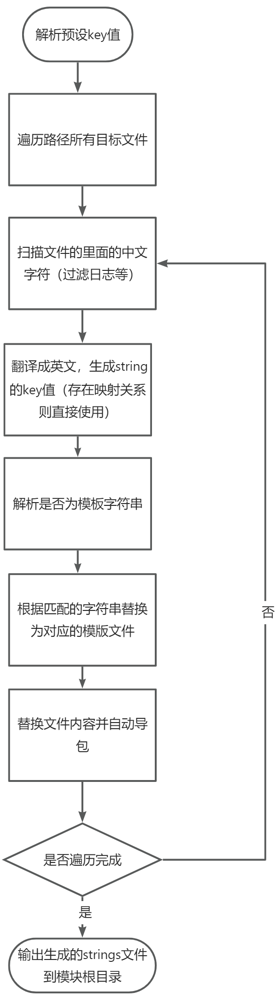

### Android 原生工程 中文硬编码抽取

将工程里面的中文硬编码抽取到string

#### 功能支持

- [x] java/kotlin代码
- [x] xml 布局文件
- [x] kotlin模版字符串
- [x] 自动生成xmlkey值、防重复策略
- [x] 自动替换引用
- [x] 自动导包
- [x] 生成新增的strings文件内容 拷贝到粘贴板

#### 使用步骤

- 使用步骤

1. 初始化配置，配置路径、是否仅扫描等

```kotlin
val modulePath = "E:\\AndroidProject\\LWanAndroid\\commonlib"
// 预设的 中文 - key 映射表
val keyMap = LinkedHashMap<String, String>()
val presetKeyMap = LinkedHashMap<String, String>()

val config = TranslateConfig(presetKeyMap, keyMap, modulePath, false, false)
```

2. 配置处理流程 包括 初始化、设置预置key、处理java、kt、XML文件以及结果输出

```kotlin
        val processors = arrayListOf(
        InitProcessor(), // todo:   必须 初始化配置 ，在里面设置翻译实例实现
        PresetKeyProcessor(arrayOf(XMLKeyParser("$modulePath/src/main/res/values/strings.xml"))), // 可选 预设的key值
        XMLFileProcessor(), // 可选 转换 xml 代码
        CodeFileProcessor(filterFileName), // 可选 转换 kotlin、java代码
        ResultOutputProcessor(), // 必须 结果输出，可自行修改为json等格式
//                GenerateEnglishProcessor() // 可选，输出英文
)
```

3. 配置预设的key值，默认为模块的strings文件

```kotlin
  (arrayOf(XMLKeyParser("$modulePath/src/main/res/values/strings.xml"))), // 可选 预设的key值
```
4. 替换百度翻译api的appid和key，或者自行实现翻译功能，默认提供百度、随机key生成，参考```ITranslateAPI```和子类

```kotlin
   InitProcessor() // todo:   必须 初始化配置 ，在里面设置翻译实例实现
```

5. 配置自动导包的内容，根据项目自行实现

```kotlin
// TransCodeUtils.kt
// todo: 根据项目 返回对应的生成的字符串模版
private fun getGenerateStringTemplate(xmlKey: String?): String {
    return "BaseApplication.getApplication().getString(R.string.$xmlKey)"
}

// todo: 根据项目 返回对应自动导入的包
fun getImportString(): Array<String> {
    return arrayOf("import com.hjl.commonlib.base.BaseApplication", "import com.hjl.commonlib.R")
}

```

5. 配置需要过滤的代码文件，默认自带log等，具体参考```ICodeStringFilter```和子类实现

```kotlin
// TransCodeUtils.kt
// 代码匹配过滤器
val codeFilter = listOf(NoteCodeFilter(), LogCodeFilter())

```

6. 运行Main.kt文件，并可以根据项目需要自行新增processor，例如英文的文件输出

```kotlin
  GenerateEnglishProcessor() // 可选，输出英文XML
```

#### 流程示意

 
